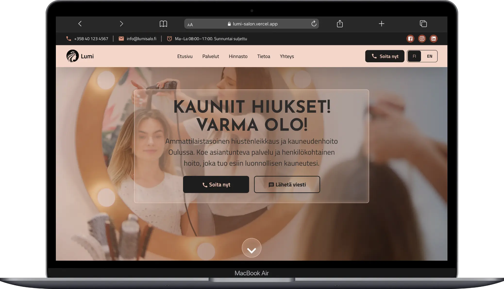

# Lumi Salon - Beauty Salon
Modern, fast, and accessible salon website built with Next.js (App Router), React, TypeScript, and Tailwind CSS. Designed to feel great for people first, and perform brilliantly for search engines and devices.


## Table of Contents

- Overview
- Features (Accessibility, Responsiveness, Performance, SEO)
- Tech Stack
- Project Structure
- Key Sections & Components
- Screenshots
- Getting Started
- Available Scripts
- Accessibility Checklist
- Performance Notes
- Deployment

## Overview

Lumi Salon is a multilingual (EN/FI) marketing site for a modern salon in Oulu. It focuses on clarity, speed, and accessibility while showcasing services, pricing, a rich visual gallery with lightbox, and easy contact options.

Highlights:
- Modular sections with lazy loading to keep initial loads snappy
- Accessible UI patterns with keyboard support and ARIA
- Optimized images, preloads, and smooth scrolling UX
- Clean separation of content (messages) from presentation

## Features

### Accessibility (A11y)
- Semantic HTML for landmarks and headings (section, header, h2/h3 hierarchy)
- Keyboard navigation (tab focus states, ESC to close lightbox, arrow keys to navigate images)
- ARIA attributes on interactive controls (tablist, previous/next/close buttons)
- Visible focus styles and logical tab order across sections
- Meaningful alternative text sourced from translations

### Responsiveness
- Tailwind CSS responsive grid and typography
- Gallery grid adapts 1–4 columns from mobile to desktop
- Images use Next.js Image with responsive sizes and object-fit behavior

### Performance
- Next.js 15 with Turbopack for speedy dev/build
- Section-level lazy loading via IntersectionObserver and React.lazy + Suspense
- Optimized LCP: preloaded hero images and fetchPriority hints
- Image optimization (Next.js Image) and WebP assets
- Smooth, offset-aware anchor scrolling for sticky headers

### SEO
- Metadata configured in `app/layout.tsx` (title, description, keywords, robots)
- Semantic headings and structured content
- Translated alt text for images
- Clean URLs and anchor navigation

## Tech Stack

- Next.js 15 (App Router)
- React 19, TypeScript 5
- Tailwind CSS 4
- Framer Motion (animations)
- MUI Icons (decorative icons)

## Project Structure

```
.
├─ app/
│  ├─ [locale]/
│  │  ├─ HomeClient.tsx        # Client entry: lazy loads sections, smooth anchor scroll
│  │  ├─ layout.tsx
│  │  └─ page.tsx
│  ├─ components/
│  │  ├─ AnimationWrapper.tsx
│  │  ├─ CTALink.tsx
│  │  ├─ GalleryGrid.tsx       # Responsive grid + lightbox state
│  │  ├─ GalleryItem.tsx       # Image tile with overlay and + icon
│  │  ├─ Lightbox.tsx          # Accessible modal, keyboard navigation
│  │  ├─ LanguageSwitcher.tsx
│  │  ├─ ContactForm.tsx, ContactCard.tsx, FormField.tsx
│  │  └─ ...other shared UI components
│  ├─ hooks/
│  │  └─ useLCPComplete.tsx
│  ├─ sections/
│  │  ├─ Hero/Hero.tsx
│  │  ├─ header/{Header,MobileMenu}.tsx
│  │  ├─ services/Services.tsx
│  │  ├─ pricing/Pricing.tsx
│  │  ├─ about/About.tsx
│  │  ├─ gallery/Gallery.tsx   # Section entry point (renders GalleryGrid)
│  │  ├─ contact/Contact.tsx
│  │  └─ footer/Footer.tsx
│  ├─ types/
│  │  ├─ gallery.ts            # Gallery types
│  │  ├─ contact.ts, pricing.ts
│  ├─ fonts.ts
│  ├─ globals.css
│  └─ layout.tsx               # SEO metadata and global HTML shell
├─ lib/
│  ├─ header.ts                # Messages and section prop types
│  ├─ gallery.ts               # Gallery helpers: images + message extraction
│  ├─ services.ts, pricing.ts, about.ts, contact.ts, ...
├─ messages/
│  ├─ en.json                  # English copy
│  └─ fi.json                  # Finnish copy
├─ public/
│  ├─ images/
│  │  ├─ hero-*.webp
│  │  ├─ gallery/              # 1.webp ... 9.webp
│  │  └─ services/, prices/
│  └─ screenshots/             # Place screenshots used in README
├─ eslint.config.mjs
├─ next.config.(js|ts)
├─ postcss.config.mjs
├─ tailwind config (via Tailwind v4)
├─ tsconfig.json
└─ package.json
```

## Key Sections & Components

### Header + Smooth Anchors
- Sticky header with in-page anchor navigation
- Smooth scrolling with an offset for the sticky bar (prevents content being hidden)

### Hero
- Optimized hero images (mobile/desktop) with preload for fast LCP

### Services & Pricing
- Structured content pulled from translations
- Pricing tabs are ARIA-compliant (proper roles/relationships)

### Gallery
- `GalleryGrid`, `GalleryItem`, and `Lightbox` components
- Hover overlay with + icon on tiles
- Lightbox supports ESC close, arrow navigation, and thumbnails
- Alt text sourced from translations (per image)

### Contact
- Accessible form fields with labels, validation copy, and helpful placeholders
- Clear success/error states; links to call/email remain keyboard-friendly

### Footer
- Semantic lists for quick links and contact info

## Internationalization (i18n)

Copy lives in JSON files under `messages/en.json` and `messages/fi.json`. Sections receive a `messages` object and read keys like `services.title`, `gallery.images.1` (alt text), etc. The Language Switcher toggles locale.

## Screenshots

Place screenshots in `public/screenshots/` and reference them here. Example:


Tip: keep filenames descriptive (e.g., `gallery-lightbox-desktop.png`).

## Getting Started

Prerequisites:
- Node.js 18.17+ (recommended 20+)
- npm (or pnpm/yarn/bun)

Install dependencies and start the dev server:

```bash
npm install
npm run dev
```

Open http://localhost:3000 to view the site. Edits hot-reload instantly.

## Available Scripts

```bash
npm run dev    # Start dev server (Turbopack)
npm run build  # Production build (Turbopack)
npm run start  # Start production server
npm run lint   # Lint codebase
```

## Accessibility Checklist

- Headings don’t skip levels (h2 → h3)
- Interactive elements are buttons/links (not divs)
- Every image has meaningful alt text
- Dialogs have `role="dialog"` and `aria-modal="true"`
- Keyboard: TAB through interactive elements; ESC closes lightbox; arrows navigate gallery
- Focus rings are visible and not removed

## Performance Notes

- LCP optimized: preloaded hero images in `app/layout.tsx`
- Lazy-load sections near the viewport (IntersectionObserver)
- Dynamic import + Suspense for large sections (Services, Pricing, About, Gallery, Contact, Footer)
- Next.js Image with responsive `sizes` and WebP assets
- Smooth scrolling and offset logic handled in `app/[locale]/HomeClient.tsx`

## Deployment

This project is deployment-ready for Vercel (recommended) or any Node-capable host.

1. Build the app: `npm run build`
2. Start the server: `npm run start`

For Vercel, connect the repo and use default Next.js settings.


If you’re exploring or extending this project, enjoy the clean structure and small-but-mighty details. If you’re shipping it to production, you already have a head start on accessibility, performance, and a calm editing experience.
